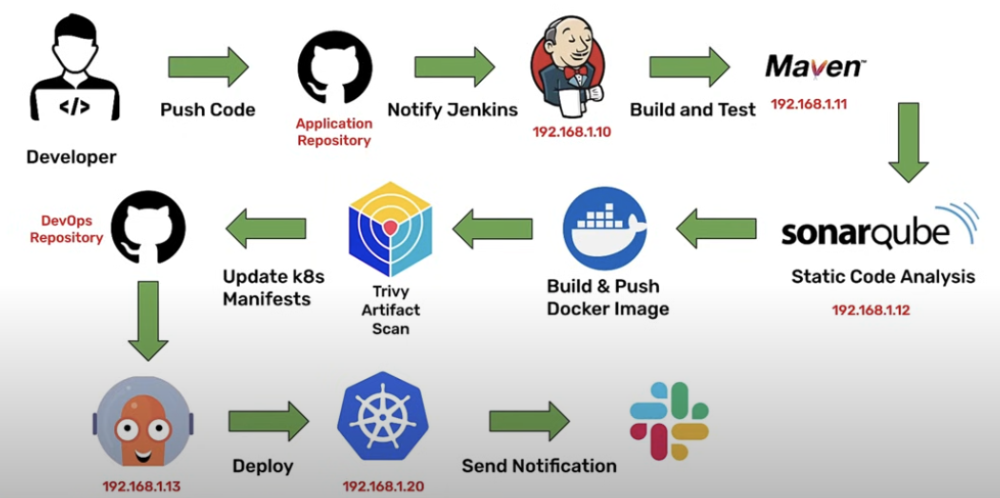

# CI-CD-pipeline-complete

This repo contains the documentation and configuration files of a full CI/CD pipeline. Environment used to showcase OWASP 10 CI/CD threats in my thesis

The pipeline is composed of the following stages:

* Push to SCM
* Build
* Test
* SCA
* Build Docker Image
* SCA Image
* Push to Docker Hub and DevOps Repository
* Deploy

The sample application processed by the pipeline is a simple Spring Boot web application \\
I have tried to replicate a real scenario as mush as possible with one virtual machine per core compenent and set up dns entries for each vm ip address with reverse proxies and tls certificates \\

The technologies stack used to implement the pipeline starts with GitHub as SCM, once code is pushed to GitHub, jenkins server is notified and pulls the pushed codebase. Jenkins is used as CI server to orchastrate the build and test steps, every time a push is made to the main branch of the application repository jenkins instance an agent to process the codebase. Jenkins server uses Maven to perform building and testing. Once the artifact has been built, jenkins communicates with SonarQube to perform static code analysis. If everything is successfull, a docker image is built and pushed to Docker Hub repository. A furter security check of the docker image is done with Trivi. If the image is secure, it is pushed to the DevOps repository. This repository is constanly monitored by ArgoCD, when it detects a new tag, it deploys to the production kubernetes cluster and send a slak notification, either the build and deployment was successfull or not with detailed information regarding the errorr. \\





## Pipeline Craft Overview

Brief overview of the pipeline creation process without covering in details all the utilities and technical terms used through the process, considering that the audience of this document already have a basic technical background.

### Jenkins

Requirements : \\
* python 3.9+


Being the orchestrator of the CI steps, Jenkins is a core component of the pipeline. Hence we start by setting up a virtual machine to host the jenkins instance. After the creation and configuration of a basic unspoilt ubuntu virtual machine, we need to make sure the machine applications packages are updated before installing java, \texttt{sudo su} , \texttt{sudo su} , \texttt{apt update} , \texttt{apt upgrade -y}. Next, in order to ensure a safe, proper and smooth java installation we need to add the Adoptium repository to the list of apt repositories sources and therefore before we need to download the adoptium PGP public key to guarantee a safe communication with adoptium. \texttt{wget -O - https://packages.adoptium.net/artifactory/api/gpg/key/public | tee /etc/apt/keyrings/adoptium.asc} , \texttt{echo "deb [signed-by=/etc/apt/keyrings/adoptium.asc] https://packages.adoptium.net/artifactory/deb $(awk -F= '/^VERSION_CODENAME/{print$2}' /etc/os-release) main" | tee /etc/apt/sources.list.d/adoptium.list}. Now we can install java 17, we prefer 17 for compatibility with the sample spring boot application. \texttt{apt update} , \texttt{apt install -y temurin-17-jdk}. Following a successfull java installation we can procees with jenkins installation, we replicate the same steps done with Adoptium. We download the jenkins PGP public key, add the jenkins repository to the apt sources list, and finally install jenkins. \texttt{curl -fsSL https://pkg.jenkins.io/debian-stable/jenkins.io-2023.key | sudo tee /usr/share/keyrings/jenkins-keyring.asc > /dev/null} , \texttt{echo "deb [signed-by=/etc/apt/keyrings/jenkins.asc] https://pkg.jenkins.io/debian-stable binary/" | tee /etc/apt/sources.list.d/jenkins.list > /dev/null}. \texttt{apt-get update} , \texttt{apt-get install -y jenkins}. This ensure a continous update of jenkins packages to the latest version just using apt, and guarantee a safe installation of jenkins plugins from the official source.
So we access Jenkins from our local machine, through his web interface running on port 8080. After logging in with the admin pwd, we start the set up of jenkins by installing the suggested plugins and creating a new user. Then we proceed with the domain name set up to access jenkins with a domain name, from wherver in the internet ot just the local network. First we need to install a reverse proxy engine, that provide routing of requests to the correct backend servers, in our case just jenkins, we'll be using the widespread engine nginx, \texttt{apt install -y nginx}. After installation, nginx should alrady be running, anyways we can check it with \texttt{systemctl status nginx}. Next, we need to configure nginx to route requests to jenkins, creating a new configuration file in the /etc/nginx/sites-available directory, \texttt{vi /etc/nginx/sites-available/jenkins.dev.cloud.diegbt.it}. The name of the file is arbitrary, I have simply chosen the domain name I bought for jenkins dashboard. We add the following configuration to the file, which is really similar to the default one but we add a directive of an upstream server running locally on port 8080 and declare to run on port 80 and redirect traffic to the jenkins server declared in the upstream block: \\
```yaml
upstream jenkins{
    server 127.0.0.1:8080;
}

server{
    listen      80;
    server_name jenkins.dev.dman.cloud;

    access_log  /var/log/nginx/jenkins.access.log;
    error_log   /var/log/nginx/jenkins.error.log;

    proxy_buffers 16 64k;
    proxy_buffer_size 128k;

    location / {
        proxy_pass  http://jenkins;
        proxy_next_upstream error timeout invalid_header http_500 http_502 http_503 http_504;
        proxy_redirect off;

        proxy_set_header    Host            $host;
        proxy_set_header    X-Real-IP       $remote_addr;
        proxy_set_header    X-Forwarded-For $proxy_add_x_forwarded_for;
        proxy_set_header    X-Forwarded-Proto https;
    }

}
```
Make sure to replace the server name directive value with your domain name. \\
Following we need to enable the configuration file, \texttt{ln -s /etc/nginx/sites-available/jenkins.dev.cloud.diegbt.it /etc/nginx/sites-enabled}. Then we need to restart nginx to apply the changes, \texttt{systemctl restart nginx}. Now we can access jenkins through the domain name we set up at http://jenkins.dev.cloud.diegbt.it. To re-create a real world scenario we just need to wrap the connection with TLS and place a firewall in front of the nginx server. We'll limit to create a TLS secured endpoint since anyways most weird requests we'll be rejeted by nginx as we are just declaring port 8080. A SSL/TLS wrap guarantees data confidentiality and integrity, it's a must have in any web application, especially where log in credentials are communicated like Jenkins. First we need to obtaiin a tls certificate from a CA, we'll use the free certificate authority let's encrypt to generate a certificate for our domain name. To simplify the set up we'll install certbot, a tool integrated with let's encrypt designed to automate the process of obtaining and renewing TLS/SSL certificates, \texttt{apt install -y certbot python3-certbot-nginx}. Then we can generate the certificate with \texttt{certbot --nginx -d jenkins.dev.cloud.diegbt.it}. We'll be prompted to enter our email address and accept the terms of service. After the certificate is generated we need to restart nginx to apply the changes, \texttt{systemctl restart nginx}. The certbot nginx plugin will take care automatically of re-configuring nginx engine whenever necessary. Certbot will manage the certificate renewal automatically by fetching expiry date and renewing the certificate if it is less than 30 days. Now we can access jenkins through the domain name at https://jenkins.dev.cloud.diegbt.it. When obtaining a certificate with nginx plug in, DNSSEC ca verifies DNSSEC records, if domain name has just been bought or your dns provider can't provde correct RRSIGs records, proceed with forcing dns-01 challenge and manual request : \texttt{certbot certonly --manual --preferred-challenges dns -v -d jenkins.dev.cloud.diegbt.it} \\
The next thing we need to do is configuring a jenkins agent that will be the machine executing the jobs, jenkins agents can be configured and managed in the same machine where jenkins is hosted, vm, docker container, and inside a kubernetes cluster. I'll be using a separate vm, accessed with ssh, that will act as agent node.


